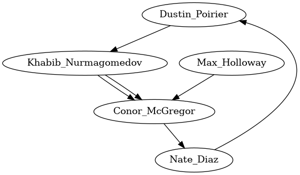

# Collections Week Challenge

## Instructions
### Lab Goal
Apply graph algorithms to model and analyze relationships between UFC fighters.

### Lab Description
In this lab, you will work with a graph that models UFC match history between fighters. You will compute metrics like centrality to gain insights in the /home/coder/rust-data-engineering/graph-centrality-ufc directory.

## Steps
1. Study the Rust code that builds a graph of fighters and UFC match history
 - Builds a graph of fighters and fights.
 - Computes a simplified centrality measure (1 / degree).
 - Prints explanations showing how connected each fighter is in the fight network.

2. Run the code and observe the output centrality scores
    ``` bash
    The closeness centrality of Dustin Poirier is 0.33
    Dustin Poirier has a centraility of 0.33, implying they had less fights compared to Connor McGregor but more than Khabib Nurmagomedov and Jose Aldo.
    -----------------
    The closeness centrality of Khabib Nurmagomedov is 0.50
    Khabib Nurmagomedov has highest centraility of 0.50, as they have fought with the least number of fighters.
    -----------------
    The closeness centrality of Jose Aldo is 0.50
    -----------------
    The closeness centrality of Conor McGregor is 0.25
    Conor McGregor has the lowest centrality because he has fought with all other fighters in the network. In this contex, a lower centrailtiy value means a higher number of fights.
    -----------------
    The closeness centrality of Nate Diaz is 0.33
    Nate Diaz has a centraility of 0.33, implying they had less fights compared to Connor McGregor but more than Khabib Nurmagomedov and Jose Aldo.
    -----------------
    ```
3. Modify the graph by adding/removing fighters and matches
    ``` rust
    let max_holloway = add_fighter(&mut graph, "Max Holloway");
    add_match(&mut graph, max_holloway, fighter_nodes[3]); // Max vs Conor
    remove_match(&mut graph, fighter_nodes[3], fighter_nodes[0]); // remove Conor vs Dustin
    remove_fighter(&mut graph, fighter_nodes[2]); // remove Jose Aldo
    ```
4. Rerun and notice how metrics like centrality change
    ``` bash
    The closeness centrality of Dustin Poirier is 0.50
    Dustin Poirier has a centraility of 0.50, implying they had less fights compared to Connor McGregor but more than Khabib Nurmagomedov and Jose Aldo.
    -----------------
    The closeness centrality of Khabib Nurmagomedov is 0.50
    Khabib Nurmagomedov has highest centraility of 0.50, as they have fought with the least number of fighters.
    -----------------
    The closeness centrality of Jose Aldo is 1.00
    -----------------
    The closeness centrality of Conor McGregor is 0.33
    Conor McGregor has the lowest centrality because he has fought with all other fighters in the network. In this contex, a lower centrailtiy value means a higher number of fights.
    -----------------
    The closeness centrality of Nate Diaz is 0.50
    Nate Diaz has a centraility of 0.50, implying they had less fights compared to Connor McGregor but more than Khabib Nurmagomedov and Jose Aldo.
    -----------------
    ```
5. Implement additional graph algorithms like shortest path
    ````bash
    The closeness centrality of Dustin Poirier is 0.50
    Dustin Poirier has a centrality of 0.50, implying they had less fights compared to Conor McGregor but more than Khabib Nurmagomedov and Jose Aldo.
    -----------------
    The closeness centrality of Khabib Nurmagomedov is 0.50
    Khabib Nurmagomedov has highest centrality of 0.50, as they have fought with the least number of fighters.
    -----------------
    The closeness centrality of Max Holloway is 1.00
    -----------------
    The closeness centrality of Conor McGregor is 0.33
    Conor McGregor has the lowest centrality because he has fought with all other fighters in the network. In this context, a lower centrality value means a higher number of fights.
    -----------------
    The closeness centrality of Nate Diaz is 0.50
    Nate Diaz has a centrality of 0.50, implying they had less fights compared to Conor McGregor but more than Khabib Nurmagomedov and Jose Aldo.
    -----------------
    +++++++++++++++++
    Shortest path (Dijkstra) between Dustin Poirier and Max Holloway is 3 fights
    +++++++++++++++++
    All‑pairs shortest paths:
    Khabib Nurmagomedov → Nate Diaz = 2 fights
    Dustin Poirier → Dustin Poirier = 0 fights
    Max Holloway → Conor McGregor = 1 fights
    Khabib Nurmagomedov → Dustin Poirier = 1 fights
    Dustin Poirier → Max Holloway = 3 fights
    Max Holloway → Khabib Nurmagomedov = 2 fights
    Max Holloway → Nate Diaz = 2 fights
    Khabib Nurmagomedov → Max Holloway = 2 fights
    Dustin Poirier → Nate Diaz = 1 fights
    Conor McGregor → Khabib Nurmagomedov = 1 fights
    Max Holloway → Dustin Poirier = 3 fights
    Nate Diaz → Max Holloway = 2 fights
    Conor McGregor → Max Holloway = 1 fights
    Nate Diaz → Khabib Nurmagomedov = 2 fights
    Conor McGregor → Dustin Poirier = 2 fights
    Nate Diaz → Conor McGregor = 1 fights
    Max Holloway → Max Holloway = 0 fights
    Dustin Poirier → Conor McGregor = 2 fights
    Conor McGregor → Conor McGregor = 0 fights
    Conor McGregor → Nate Diaz = 1 fights
    Nate Diaz → Dustin Poirier = 1 fights
    Nate Diaz → Nate Diaz = 0 fights
    Dustin Poirier → Khabib Nurmagomedov = 1 fights
    Khabib Nurmagomedov → Khabib Nurmagomedov = 0 fights
    Khabib Nurmagomedov → Conor McGregor = 1 fights
    +++++++++++++++++
    ```

## Reflection Questions
1. How do connections between fighters impact centrality scores?
    - **Degree centrality**: The more opponents a fighter has, the higher their degree. In your simplified closeness measure (`1/degree`), more connections actually lower the score, but in standard graph theory, more connections usually mean higher centrality.
    - **Closeness centrality**: Fighters connected to many others (directly or indirectly) will have shorter average path lengths to everyone else, making them more “central” in the fight network.
    - **Betweenness centrality**: A fighter who connects otherwise separate groups (say, bridging lightweight and featherweight divisions) will score high, because many shortest paths pass through them.

2. When would you use directed vs undirected graphs?
    - **Undirected**: Best when fights are mutual events (both fighters participate equally). That’s what you used — it captures “they fought” without worrying about direction.
    - **Directed**: Useful if you want to encode *outcomes*. For example:
    - An edge from Fighter A → Fighter B could mean “A defeated B.”
    - This allows ranking systems, dominance hierarchies, or win/loss flow analysis.
    - In UFC, undirected graphs are fine for participation networks, but directed graphs are better if you want to study *who beats whom*.

3. What are some limitations of representing UFC fights as a simple graph?
    - **No weights for fight importance**: A title fight and a prelim bout are treated equally.
    - **No outcomes**: You only know they fought, not who won.
    - **No temporal dimension**: Fights across decades are treated the same as recent ones.
    - **No attributes**: Weight class, fight style, or event context are missing.
    - **No multiple fights**: If two fighters fought three times, a simple graph only shows one edge.

4. How could additional metadata like match dates improve analysis?
    - **Temporal networks**: You can track how fighters’ connections evolve over time (career arcs).
    - **Recency weighting**: More recent fights could be given higher importance in rankings.
    - **Streak analysis**: Identify clusters of fights in short periods (busy years vs. inactive years).
    - **Era comparisons**: Compare centrality across different UFC eras (e.g., early 2000s vs. 2020s).

5. What other domains could benefit from relationship modeling like this?
    - **Social networks**: Friendships, collaborations, or communication patterns.
    - **Transportation**: Airports and flight routes, or road networks.
    - **Biology**: Protein–protein interactions, neural networks, food webs.
    - **Finance**: Connections between banks, loans, or stock correlations.
    - **Healthcare**: Patient–doctor networks, disease transmission graphs.
    - **Tech ecosystems**: Dependencies between software packages (like Rust crates you work with).
    - **Knowledge graphs**: Linking concepts, documents, or research papers.

## Challenges
1. Compute centrality scores using a different algorithm.
    1. **Shortest paths**: For every pair of fighters (nodes) in the graph, you find the shortest path(s) connecting them.
    2. **Count intermediaries**: For each shortest path, you check which fighters lie *in between* the start and end nodes.
    3. **Contribution**: If a fighter lies on many shortest paths between others, they get a higher score.
    4. **Result**: Fighters with high betweenness are “bridges” — they connect otherwise separate groups of fighters.

    - **Conor McGregor**: fought Aldo, Khabib, Poirier, Diaz, Holloway. He connects many subgroups, so he’ll appear on lots of shortest paths → high betweenness.
    - **Khabib Nurmagomedov**: fought fewer opponents, mostly within lightweight. He won’t appear on many shortest paths → lower betweenness.
    - **Nate Diaz**: fought Conor and Dustin, so he might appear as a bridge between fighters who otherwise aren’t directly connected.

    * Why It’s Useful
    - Identifies “connectors” in the network.
    - In UFC, shows fighters who link divisions, eras, or clusters of opponents.
    - In other domains (social networks, biology, transport), it highlights bottlenecks or influencers.

    ```bash
    Betweenness centrality of Max Holloway is 0.00
    Betweenness centrality of Conor McGregor is 4.00
    Betweenness centrality of Khabib Nurmagomedov is 1.00
    Betweenness centrality of Nate Diaz is 1.00
    Betweenness centrality of Dustin Poirier is 2.00
    ```
2. Find the shortest path between two fighters based on number of bouts.
    - Model fighters as nodes and bouts as edges in a graph.
    - To find the shortest path between two fighters, the algorithm looks for the minimum number of edges connecting them. Each edge represents one fight.
    - It starts at the first fighter and explores connected fighters step by step, keeping track of the distance (number of bouts).
    - When it reaches the target fighter, it knows the shortest chain of fights that links them.
    - The result is both the path length (how many bouts are needed) and the sequence of fighters along that path.

    So if Dustin fought Conor directly, the shortest path is just one bout. If Dustin never fought Max Holloway, but both fought Conor, then the shortest path is two bouts: Dustin → Conor → Max.

    ```bash
    Shortest path between Dustin Poirier and Conor McGregor is 2 bouts
    Path: ["Dustin Poirier", "Khabib Nurmagomedov", "Conor McGregor"]
    ```
3. Visualize the graph network using a library like Graphviz.
    - Use the `graphviz-rust` crate to create a visual representation of the fighter network.
    - Each fighter is represented as a node, and each bout is represented as an edge connecting two nodes.
    - You can customize node labels with fighter names and styles to enhance readability.
    - The generated graph can be exported as an image (e.g., PNG) for easy viewing.
    - This visualization helps to intuitively understand the relationships and connectivity between fighters.
    

    > **Note:** Requires additional Graphviz installation on your system to render the image.

4. Enhance fighter profiles with additional statistics like reach.
    - Extend the `Fighter` struct to include attributes like reach, height, and weight class.
    - Use these attributes to analyze how physical characteristics correlate with fight outcomes or centrality scores.
    - For example, investigate if fighters with longer reach tend to have higher centrality due to more fight opportunities.
    - This enriched data can lead to deeper insights into fighter performance and matchmaking strategies.
    ``` bash
    Dustin Poirier (Reach: 183 cm, Height: 178 cm, Class: Lightweight) → Closeness 0.50
    Khabib Nurmagomedov (Reach: 178 cm, Height: 178 cm, Class: Lightweight) → Closeness 0.50
    Max Holloway (Reach: N/A cm, Height: N/A cm, Class: Unknown) → Closeness 1.00
    Conor McGregor (Reach: 188 cm, Height: 175 cm, Class: Lightweight) → Closeness 0.33
    Nate Diaz (Reach: 193 cm, Height: 183 cm, Class: Welterweight) → Closeness 0.50
    ```
5. Expand to additional sports leagues like boxing or MMA organizations.
    - Adapt the graph model to represent fighters and match histories from other combat sports like boxing or organizations like Bellator.
    - Each sport may have different matchmaking dynamics, weight classes, and fight frequencies, which can be analyzed using similar graph algorithms.
    - This expansion allows for comparative studies across sports, identifying unique patterns in fighter connectivity and centrality.
    - It also broadens the applicability of your graph analysis skills to various athletic domains.
    organization: String,   // e.g. "UFC", "Bellator", "ONE", "Boxing"
